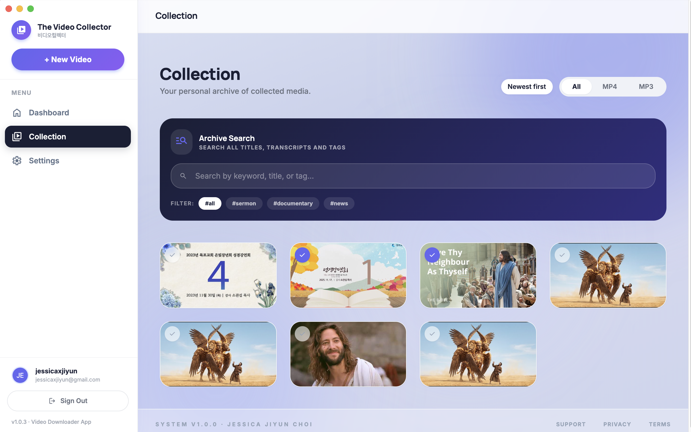
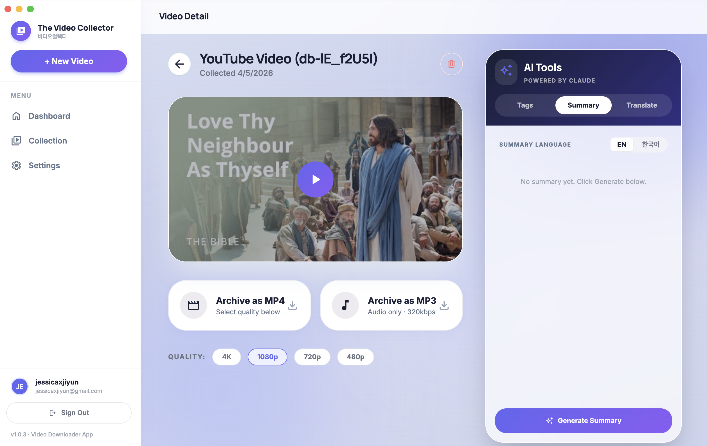

# 📹 Video Collector — 비디오 컬렉터

> A desktop application for downloading, organizing, and AI-analyzing YouTube videos — built for pastors and ministry teams.


---

## Overview

**Video Collector** is an Electron-based desktop app designed to help church pastors and ministry teams collect YouTube sermon videos, archive them locally, and use AI to generate summaries and Korean/English translations — all in one place.

Built and actively used by pastors at a local church. Shipped across **4 versioned releases** (v1.0.0 → v1.0.3).

---

## Features

### 🏠 Dashboard
Paste any YouTube URL and hit **Collect** to instantly add a video to your archive. The dashboard shows your most recently collected videos at a glance.


---

### 📚 Collection
Browse and manage your full video archive with filtering by format (MP4 / MP3) and sorting by newest. Use the **Archive Search** panel to search across all video titles, transcripts, and tags in one query.

Tag-based filtering lets you quickly surface content by category — `#sermon`, `#documentary`, `#news`, and more.



---

### 🤖 AI Tools — Powered by Claude
Each video includes an **AI Tools** panel with three capabilities:

- **Summary** — Generate an AI summary of the video in English or Korean (한국어)
- **Translate** — Get a full Korean/English bilingual translation of the transcript
- **Tags** — Auto-generate relevant tags for organization

Videos can be archived as **MP4** (up to 4K / 1080p / 720p / 480p) or **MP3** (320kbps audio only).



---

## Chrome Extension

A companion **Google Chrome Extension** adds a one-click **Collect** button directly on YouTube pages, letting users send videos to the app without copying and pasting URLs manually.

📦 Download: [`VideoCollector-Extension.zip`](./VideoCollector-Extension.zip)

**To install:**
1. Download and unzip `VideoCollector-Extension.zip`
2. Open Chrome and navigate to `chrome://extensions`
3. Enable **Developer Mode** (top right)
4. Click **Load unpacked** and select the unzipped folder

---

## Tech Stack

| Layer | Technology |
|---|---|
| Desktop App | Electron, HTML, CSS, JavaScript |
| AI Features | Claude API (Anthropic) |
| Backend / Storage | Firebase |
| Browser Extension | Chrome Extension API, JavaScript |

---

## Getting Started

```bash
# Clone the repo
git clone https://github.com/wldbs31/Video-Collector-for-Pastors.git
cd Video-Collector-for-Pastors

# Install dependencies
npm install

# Run the app
npm start
```

---

## Releases

| Version | Notes |
|---|---|
| v1.0.3 | Latest release |
| v1.0.2 | Bug fixes |
| v1.0.1 | UI improvements |
| v1.0.0 | Initial release |

See all releases → [GitHub Releases](https://github.com/wldbs31/Video-Collector-for-Pastors/releases)

---

## Author

**Jessica Jiyun Choi**  
[linkedin.com/in/jiyun-jessica-choi](https://linkedin.com/in/jiyun-jessica-choi) · [github.com/wldbs31](https://github.com/wldbs31)
